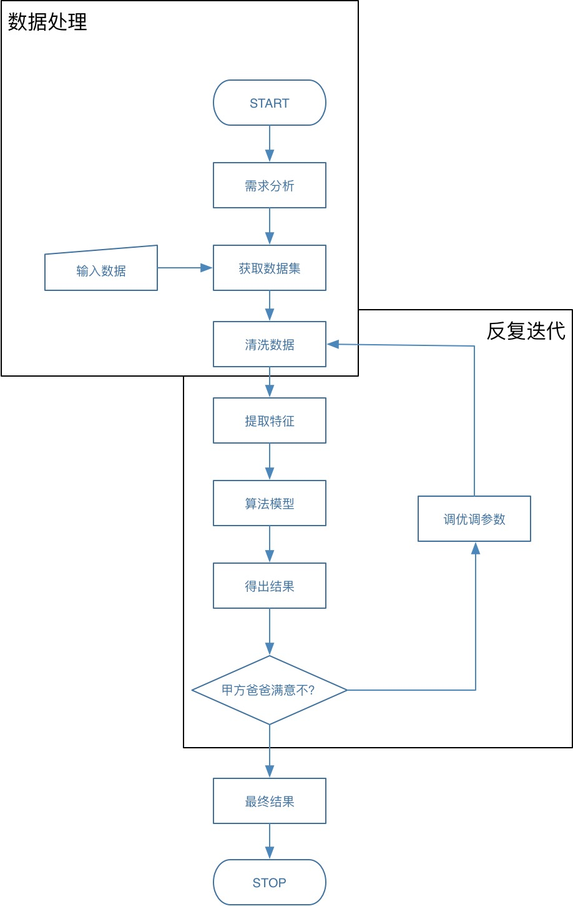

# 先放一下理论，我们从第一个模型开始

看起来最入门也是最新手友好地的就是线性模型了吧，至于《机器学习》中提到的第二张的判定一个模型好坏和验证的办法我们先放一下，毕竟我们连整个流程都没有走通，怎么样理解那些基本研究方法？

## 准备知识

最基础的理论在 Day2 的其它 PDF 中已经手动推导过了

那么，马上去看对数线性回归或者其它回归其实并不是特别理智，我们既然已经知道这第一个模型是怎么一回事儿了，那么就可以来走一遍流程了

[随便找了个看起来不错的应用，URL在这里](http://bluewhale.cc/2017-08-10/use-tensorflow-to-train-linear-regression-models-and-predict.html)

准备初次接触 ML 的学习吧

## 依赖

*  tensorflow
*  numpy
*  matplotlib

这三个库都可以 pip install 是不是很开心？

## Quick Start



这个图表示我们如果要使用炼丹大法做某一个事情的事，需要经历的步骤。那么我们进行 Quick Look 实验的时候，就可以快一点跑起来再说，我们先要一个滑板吧，有钱了再改成自行车。

## Talk is cheep

```Python
#!/usr/bin/env python
#coding:utf-8
"""
  Author:  v1ll4n --<>
  Purpose: research the relationship between ad and money.
  Created: 11/07/17
"""

import tensorflow
import numpy


# prepare your data set
money = numpy.array([[109],[82],[99], [72], [87], [78], [86], [84], [94], [57]]).astype(numpy.float32)
click = numpy.array([[11], [8], [8], [6],[ 7], [7], [7], [8], [9], [5]]).astype(numpy.float32)

# well, divide our data set into testing data and training data
X_test = money[0:5].reshape(-1,1)
Y_test = click[0:5]
X_train = money[5:].reshape(-1,1)
y_train = click[5:]

#
# build our model using tensorflow
# 这里是非常重要的部分吧，来我给大家翻译一下，PlaceHolder 就相当于是新建了一个未知量
# 未知量就是一个占位符，这个占位符是我们之后要传入数据的，就好像是我们写了一个方程，然后
# 把具体的数带入方程中进行计算。
#
# Variable 就是常量，建立了一个值，在下面的使用还带了初始值。
#
# tensorflow setting placeholder
placeholder_x = tensorflow.placeholder(tensorflow.float32, [None, 1])
w = tensorflow.Variable(initial_value=tensorflow.zeros([1,1]))
W = w # alias it
b = tensorflow.Variable(initial_value=tensorflow.zeros([1]))

# 这一步 matmul 一看就是 matrix multiple 啥的。。。矩阵相乘的意思
# 所以这里的意思也就是 y = f(x) = w * x + b
# 建立了一个函数。这个函数 w b 是我们想要求出来的具体的值。
# x（placeholder） 是我们要喂进去的数据
y = tensorflow.matmul(placeholder_x, w) + b

# 这里和 x 一样吧，准备建立一个占位符，等着喂 y 进来。
placeholder_y = tensorflow.placeholder(tensorflow.float32, [None, 1])

# 好的到了这里，大家都还是可以看得懂的。非常的愉快
# tensor reduce_sum 就是求和，我们看后面 pow(placeholder_y - y, 2) 就能认得出
# 这里就是用最小二乘法求和
cost = tensorflow.reduce_sum(tensorflow.pow(placeholder_y - y, 2)) # (yi - f(xi))^2

# train_step 这里大家可能不太理解这是咋回事儿，咋又是 GradientDescent 啥的。。。
# 这里说明，我们并不是使用直接的矩阵运算去求值的，那用的是什么呢？
# 梯度下降算法，关于这个算法明天我们会说，总之，反正就是用了一个算法
# 定了一个步长
# 这样就可以开始建立 Session 求值了
train_step = tensorflow.train.GradientDescentOptimizer(0.000001).minimize(cost)

#
# startup model 常规操作
#
init = tensorflow.global_variables_initializer()
session = tensorflow.Session()
session.run(init)
sess = session
cost_history = []

for i in range(1000):
    feed = {
        placeholder_x: X_train,
        placeholder_y: y_train
    }
    
    # 梯度下降一个步长
    session.run(train_step, feed)
    
    # 记录 and Debug IO
    cost_history.append(session.run(cost, feed_dict=feed))
    print('After {} iteration'.format(i))
    print('w: {} b: {} cost: {}'.format(session.run(w), session.run(b), session.run(cost, feed_dict=feed)))

print('w_value: {} b_value: {} cost: {}'.format(session.run(w), session.run(b), session.run(cost, feed)))
```

好的了，贴一下最后的结果

```
...............
...............
...............
...............
...............
w: [[ 0.09045191]] b: [ 0.00091837] cost: 1.0432755947113037
After 990 iteration
w: [[ 0.09045191]] b: [ 0.00091818] cost: 1.0432755947113037
After 991 iteration
w: [[ 0.09045191]] b: [ 0.00091799] cost: 1.0432748794555664
After 992 iteration
w: [[ 0.09045192]] b: [ 0.0009178] cost: 1.0432755947113037
After 993 iteration
w: [[ 0.09045192]] b: [ 0.00091761] cost: 1.0432748794555664
After 994 iteration
w: [[ 0.09045193]] b: [ 0.00091742] cost: 1.043274998664856
After 995 iteration
w: [[ 0.09045193]] b: [ 0.00091723] cost: 1.043274998664856
After 996 iteration
w: [[ 0.09045193]] b: [ 0.00091704] cost: 1.0432744026184082
After 997 iteration
w: [[ 0.09045193]] b: [ 0.00091685] cost: 1.0432753562927246
After 998 iteration
w: [[ 0.09045193]] b: [ 0.00091666] cost: 1.0432747602462769
After 999 iteration
w: [[ 0.09045193]] b: [ 0.00091648] cost: 1.0432753562927246
w_value: [[ 0.09045193]] b_value: [ 0.00091648] cost: 1.0432753562927246
```

好的了，这就是我们训练的结果，求出了 w_value 和 b_value ，轻松愉快，并且发现了这个 cost 稳定在了 1.04327 虽然不知道这个东西到底是啥意思但是，我们知道我们的滑板能跑了。

## TODO

那么这是最简单的情形对吧，这才一个属性了，那么对于多个属性我们应该怎么样去操作呢？明天来解决这个问题。还有大家记得，我们把数据集分成了两个部分，一个是测试集，一个是训练集，那么我们为什么要这么做呢？还有今天看不懂的，梯度下降的算法，这是咋回事儿啊？

好了明天再说。。。